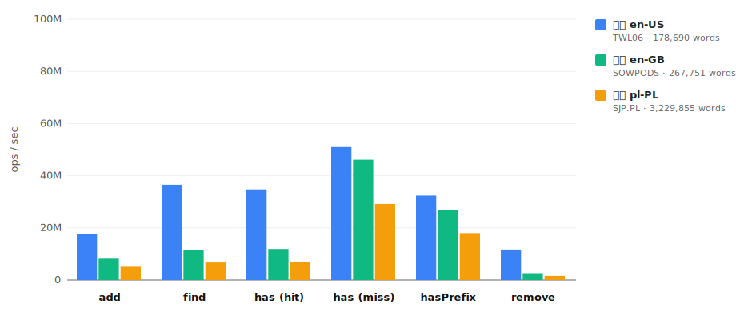
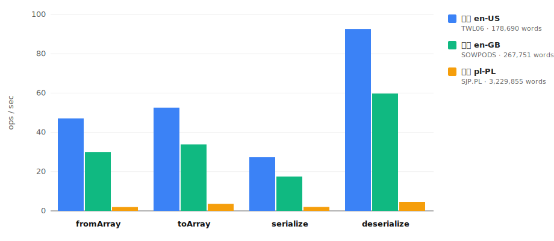

# @kamilmielnik/trie


[Trie](https://en.wikipedia.org/wiki/Trie) data structure implemented in TypeScript:

- [Highly performant](#performance)
- No dependencies
- Lightweight
- [Well-documented](docs/README.md)
- Built for [Scrabble Solver](https://github.com/kamilmielnik/scrabble-solver)
- CJS & ESM compatible

# Table of contents

- [Installation](#installation)
- [API](#api)
  - [Object-oriented API](#object-oriented-api)
  - [Functional API](#functional-api)
- [Examples](#examples)
  - [Load dictionary from file](#load-dictionary-from-file)
  - [Serialize `Node` to a file](#serialize-node-to-a-file)
  - [Load serialized `Node` from a file](#load-serialized-node-from-a-file)
  - [Find all words with given prefix](#find-all-words-with-given-prefix)
- [Serialization and compression](#serialization-and-compression)
- [Performance](#performance)

# Installation

```Shell
# Bun
bun add @kamilmielnik/trie

# npm
npm install @kamilmielnik/trie

# Yarn
yarn add @kamilmielnik/trie
```

# [API](docs/README.md)

See full [API Docs](docs/README.md) - generated by [typedoc](http://typedoc.org/).

Good to know:

- all objects are mutable
- every class, interface, type, constant and function is exported
- all exports are named (there is no default export)

There are 2 ways to use the API.

## [Object-oriented API](docs/README.md#classes)

Create [`Trie`](docs/classes/Trie.md) instance and use its methods.

### Example

```ts
import { Trie } from '@kamilmielnik/trie';

const trie = new Trie();
trie.add('master');
trie.add('mask');
trie.hasPrefix('man'); // false
trie.hasPrefix('mas'); // true
trie.has('mas');       // false
trie.remove('mas');    // false
trie.has('master');    // true
trie.serialize();      // "(m(a(s(t(e(r))k))))"
trie.remove('master'); // true
trie.serialize();      // "(m(a(s(k))))"
```

## [Functional API](docs/README.md#functions)

Manipulate existing instances of [`Node`](docs/interfaces/Node.md) with [functions](docs/README.md#functions).

### Example

The following example works identically to the object-oriented example above.

```ts
import { add, has, hasPrefix, Node, remove, serialize } from '@kamilmielnik/trie';

const root: Node = {};

add(root, 'master');
add(root, 'mask');
hasPrefix(root, 'man'); // false
hasPrefix(root, 'mas'); // true
has(root, 'mas');       // false
remove(root, 'mas');    // false
has(root, 'master');    // true
serialize(root);        // "(m(a(s(t(e(r))k))))"
remove(root, 'master'); // true
serialize(root);        // "(m(a(s(k))))"
```

# Examples

- [Load dictionary from file](#load-dictionary-from-file)
- [Serialize `Node` to a file](#serialize-node-to-a-file)
- [Load serialized `Node` from a file](#load-serialized-node-from-a-file)
- [Find all words with given prefix](#find-all-words-with-given-prefix)

## Load dictionary from file

```ts
import { fromArray, Node } from '@kamilmielnik/trie';
import fs from 'fs';

const fromFile = (filepath: string): Node => {
  const file = fs.readFileSync(filepath, 'utf-8');
  // Assuming file contains 1 word per line
  const words = file.split('\n').filter(Boolean);
  const node = fromArray(words);
  return node;
};
```

## Serialize [`Node`](docs/interfaces/Node.md) to a file

```ts
import { Trie } from '@kamilmielnik/trie';
import fs from 'fs';

const toFile = (filepath: string, trie: Trie): void => {
  const serialized = trie.serialize();
  fs.writeFileSync(filepath, serialized);
};
```

## Load serialized [`Node`](docs/interfaces/Node.md) from a file

```ts
import { deserialize, Node } from '@kamilmielnik/trie';
import fs from 'fs';

const fromFile = (filepath: string): Node => {
  const serialized = fs.readFileSync(filepath, 'utf-8');
  const node = deserialize(serialized);
  return node;
};
```

## Find all words with given prefix

```ts
import { find, Node, toArray } from '@kamilmielnik/trie';

const findWordsWithPrefix = (node: Node, prefix: string): string[] => {
  const prefixNode = find(node, prefix) || {};
  const descendants = toArray(prefixNode, { prefix, sort: true, wordsOnly: true });
  const words = descendants.map(({ prefix: word }) => word);
  return words;
};
```

# Serialization and compression

This package can be used to efficiently [serialize](docs/functions/serialize.md) and compress dictionaries.
<!-- COMPRESSION:summary:start -->
It reaches 66.40 [compression ratio](https://en.wikipedia.org/wiki/Data_compression_ratio) (98.49% space saving) for SJP.PL (pl-PL) when combined with [7-Zip](https://en.wikipedia.org/wiki/7z) at ultra compression level.
<!-- COMPRESSION:summary:end -->

<!-- COMPRESSION:start -->
| Language | 🇺🇸 en-US | 🇬🇧 en-GB | 🇵🇱 pl-PL |
| --- | --- | --- | --- |
| Name | [TWL06](https://en.wikipedia.org/wiki/NASPA_Word_List) | [SOWPODS](https://en.wikipedia.org/wiki/Collins_Scrabble_Words) | [SJP.PL](https://sjp.pl/slownik/dp.phtml) |
| Source | [Download](https://raw.githubusercontent.com/kamilmielnik/scrabble-dictionaries/master/english/twl06.txt) | [Download](https://raw.githubusercontent.com/kamilmielnik/scrabble-dictionaries/master/english/sowpods.txt) | [Download](https://raw.githubusercontent.com/kamilmielnik/scrabble-dictionaries/master/polish/sjp.txt) |
| Words count | 178,690 | 267,751 | 3,229,855 |
| File size [B] | 1,763,166 | 2,707,020 | 42,172,320 |
| File size (serialized) [B] | (-42.38%) 1,016,004 | (-43.94%) 1,517,454 | (-69.40%) 12,903,507 |
| File size ([7z](https://en.wikipedia.org/wiki/7z)) [B] | (-78.54%) 378,418 | (-79.23%) 562,247 | (-86.84%) 5,550,546 |
| File size (serialized + [7z](https://en.wikipedia.org/wiki/7z)) [B] | (-89.25%) 189,484 | (-89.78%) 276,737 | (-98.49%) 635,085 |
<!-- COMPRESSION:end -->

# Performance

Benchmarks are produced by [`bench/index.ts`](bench/index.ts) using [tinybench](https://github.com/tinylibs/tinybench). Run `bun run bench` to regenerate the charts below.

[`add`](docs/functions/add.md), [`find`](docs/functions/find.md), [`has`](docs/functions/has.md), [`hasPrefix`](docs/functions/hasPrefix.md), [`remove`](docs/functions/remove.md) are very fast - $O(\log_2 n)$ (millions of operations per second).

<!-- BENCH:fast:start -->

<!-- BENCH:fast:end -->

---

[`deserialize`](docs/functions/deserialize.md), [`fromArray`](docs/functions/fromArray.md), [`serialize`](docs/functions/serialize.md), [`toArray`](docs/functions/toArray.md) are slow - $O(n)$ (few operations per second).

<!-- BENCH:slow:start -->

<!-- BENCH:slow:end -->
